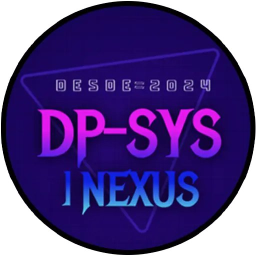

# 🚀 DP-SYS NEXUS

<div align="center">
  
  <h1>Tu Nexus Personal de Entretenimiento</h1>
  <p><strong>Juegos · Películas · Series · Social · Watchlist</strong></p>

[](https://dpsys-nexus.vercel.app)
[](https://supabase.com)
[](https://github.com/DonPlastico/WEB-Multiusos)

</div>

---

## 📖 Índice

- [🎯 Sobre el Proyecto](#-sobre-el-proyecto)
- [✨ Características Principales](#-características-principales)
- [🛠️ Tecnologías Utilizadas](#️-tecnologías-utilizadas)
- [📡 APIs Integradas](#-apis-integradas)
- [🏗️ Estructura del Proyecto](#️-estructura-del-proyecto)
- [🚀 Instalación Local](#-instalación-local)
- [🔧 Variables de Entorno](#-variables-de-entorno)
- [📱 Funcionalidades Detalladas](#-funcionalidades-detalladas)
  - [🎮 Juegos](#-juegos)
  - [🎬 Películas](#-películas)
  - [📺 Series](#-series)
  - [👤 Perfil de Usuario](#-perfil-de-usuario)
  - [📋 Watchlist (TV Time Style)](#-watchlist-tv-time-style)
  - [💬 Social & Chat](#-social--chat)
  - [🛡️ Panel de Administración](#️-panel-de-administración)
  - [🎨 Personalización](#-personalización)
- [🌐 Despliegue](#-despliegue)
- [📊 Estructura de Base de Datos](#-estructura-de-base-de-datos)
- [🤝 Contribución](#-contribución)
- [📄 Licencia](#-licencia)
- [🗺️ Roadmap — Funcionalidades Futuras](#️-roadmap--funcionalidades-futuras)
- [♿ Accesibilidad — Mejoras Pendientes](#-accesibilidad--mejoras-pendientes)

---

## 🎯 Sobre el Proyecto

**DP-SYS NEXUS** es una aplicación web todo-en-uno que centraliza la gestión de tu entretenimiento digital. Inspirada en plataformas como **TV Time**, **The Movie DB** y **AllKeyshop**, combina lo mejor de cada una en una interfaz única con estilo cyberpunk/neon.

### 🎯 Misión

Proporcionar un **nexus personal** donde los usuarios puedan:

- Descubrir y explorar juegos, películas y series
- Gestionar su progreso de visionado
- Conectar con otros usuarios
- Recibir recomendaciones personalizadas
- Seguir tendencias en tiempo real

---

## ✨ Características Principales

### 🎮 Gestión de Juegos

- 🔍 Búsqueda avanzada con filtros (tiendas, plataformas, géneros, precios, fechas)
- 💰 Precios en tiempo real desde **ITAD** (IsThereAnyDeal)
- 🏷️ Enlaces directos a **AllKeyshop** y **CDKeys**
- 📊 Tendencias por día, semana, mes y año
- 🖥️ Detalles completos: desarrollador, editor, géneros, modos de juego

### 🎬 Películas y Series

- 📡 Datos enriquecidos desde **TMDB**
- 🎭 Tráilers oficiales de YouTube
- 🎬 Reparto principal con fotos
- 📺 Proveedores de streaming (suscripción, alquiler, compra)
- 🌍 Filtros por país/idioma
- 🔞 Control de contenido +18
- ⭐ Valoraciones globales y personales

### 👤 Perfil de Usuario

- 🖼️ Banners y avatares personalizables (predefinidos o subida custom)
- 📊 Estadísticas detalladas de tiempo de visionado
- 🎯 Recomendaciones personalizadas basadas en tus últimos 7 visionados
- 👥 Sistema de seguidores y siguiendo
- 📋 Watchlist estilo **TV Time**

### 💬 Social & Comunidad

- 👥 Buscar y seguir a otros usuarios
- 💬 Chatbox con mensajes y notificaciones
- 🔔 Alertas de nuevos seguidores
- 📋 Listas de seguidores/siguiendo con paginación

### 🛡️ Panel de Administración

- 👥 Gestión completa de usuarios
- 🔑 Asignación de roles (admin/user)
- 🧪 Creación de usuarios de prueba
- 📊 Métricas en tiempo real
- 📋 Terminal de logs de eventos
- 📢 Transmisión global de anuncios

### 🎨 Personalización

- 🌗 3 modos de tema: Sistema, Claro, Oscuro
- 🎨 Color destacado personalizable (RGB + preseleccionados)
- 🌍 8 idiomas soportados (ES, EN, FR, IT, DE, ZH, JA, KO)
- 🖼️ Avatares y banners custom

---

## 🛠️ Tecnologías Utilizadas

### Frontend

| Tecnología            | Uso                              |
| --------------------- | -------------------------------- |
| **HTML5**             | Estructura de la aplicación      |
| **CSS3**              | Estilizado, animaciones, temas   |
| **JavaScript (ES6+)** | Lógica de la aplicación          |
| **Vite**              | Bundler y servidor de desarrollo |

### Backend

| Tecnología           | Uso                                          |
| -------------------- | -------------------------------------------- |
| **Vercel Functions** | API serverless                               |
| **Supabase**         | Autenticación, base de datos, almacenamiento |

### Librerías y Herramientas

| Librería                    | Uso                         |
| --------------------------- | --------------------------- |
| **Flatpickr**               | Selectores de fecha         |
| **CropperJS**               | Recorte de avatares/banners |
| **Font Awesome**            | Iconografía                 |
| **Google Fonts (Rajdhani)** | Tipografía principal        |

### Analytics & Monitoreo

| Herramienta               | Uso                     |
| ------------------------- | ----------------------- |
| **Google Analytics**      | Análisis de tráfico     |
| **Vercel Analytics**      | Métricas de rendimiento |
| **Vercel Speed Insights** | Monitoreo de velocidad  |

---

## 📡 APIs Integradas

### 🎮 IGDB (Internet Game Database)

- **Función**: Base de datos de juegos
- **Uso**: Búsqueda, filtros, detalles, tendencias
- **Autenticación**: OAuth2 via Twitch

### 💰 ITAD (IsThereAnyDeal)

- **Función**: Precios de juegos en tiendas digitales
- **Uso**: Mejor precio, tiendas, URLs de compra
- **Integración**: Enriquecimiento de juegos IGDB

### 🎬 TMDB (The Movie Database)

- **Función**: Base de datos de películas y series
- **Uso**: Búsqueda, filtros, detalles, tráilers, reparto, proveedores
- **Autenticación**: Bearer Token

### 🔐 Supabase

- **Función**: Autenticación, base de datos, almacenamiento
- **Uso**: Usuarios, roles, watchlist, amistades, avatares/banners

---

## 🏗️ Estructura del Proyecto

```
WEB-Multiusos/
├── 📁 api/
│   ├── 📄 igdb.js          # API de juegos (IGDB + ITAD)
│   ├── 📄 itad.js          # API de precios (ITAD standalone)
│   └── 📄 tmdb.js          # API de películas/series (TMDB)
├── 📁 img/
│   ├── 📁 Avatars/         # Avatares predefinidos (8 opciones)
│   ├── 📁 Banners/         # Banners predefinidos (5 opciones)
│   ├── 🖼️ Fondo.webp       # Fondo de la web
│   ├── 🖼️ Logo.webp        # Logo principal
│   └── 🖼️ prox.webp        # Placeholder
├── 📁 public/
│   └── 📄 robots.txt       # Configuración de robots
├── 📄 index.html           # Estructura HTML completa
├── 📄 main.js              # Lógica principal de la aplicación
├── 📄 style.css            # Estilos y temas
├── 📄 supabase.js          # Cliente de Supabase
├── 📄 package.json         # Dependencias y scripts
├── 📄 vercel.json          # Configuración de Vercel
└── 📄 README.md            # Este archivo
```

---

## 🚀 Instalación Local

### Prerrequisitos

- Node.js 18+
- npm o yarn
- Cuentas en:
  - [Twitch Developers](https://dev.twitch.tv/) (para IGDB)
  - [ITAD API](https://isthereanydeal.com/) (para precios)
  - [TMDB](https://www.themoviedb.org/) (para películas/series)
  - [Supabase](https://supabase.com/) (para autenticación y BD)

### Pasos de Instalación

```bash
# 1. Clonar el repositorio
git clone https://github.com/DonPlastico/WEB-Multiusos.git
cd WEB-Multiusos

# 2. Instalar dependencias
npm install

# 3. Crear archivo de variables de entorno
cp .env.example .env.local

# 4. Configurar variables de entorno (ver sección abajo)
nano .env.local

# 5. Iniciar servidor de desarrollo
npm run dev

# 6. Abrir en el navegador
# http://localhost:5173
```

### Comandos Disponibles

```bash
npm run dev       # Servidor de desarrollo
npm run build     # Build de producción
npm run preview   # Vista previa de producción
```

---

## 🔧 Variables de Entorno

Crea un archivo `.env.local` en la raíz del proyecto:

```env
# ================================
#   SUPABASE
# ================================
VITE_SUPABASE_URL=tu_url_de_supabase
VITE_SUPABASE_ANON_KEY=tu_clave_anonima_de_supabase

# ================================
#   TWITCH (para IGDB)
# ================================
TWITCH_CLIENT_ID=tu_client_id_de_twitch
TWITCH_CLIENT_SECRET=tu_client_secret_de_twitch

# ================================
#   ITAD (precios de juegos)
# ================================
ITAD_API_KEY=tu_api_key_de_itad

# ================================
#   TMDB (películas y series)
# ================================
TMDB_TOKEN=tu_bearer_token_de_tmdb

# ================================
#   VERCEL
# ================================
VERCEL=1
```

---

## 📱 Funcionalidades Detalladas

### 🎮 Juegos

#### Búsqueda y Exploración

- 🔍 Búsqueda por nombre con autocompletado
- 📜 Historial de búsquedas recientes (últimas 20)
- 🖱️ Scroll infinito con carga de más resultados

#### Filtros Avanzados

| Categoría       | Opciones                                                                                      |
| --------------- | --------------------------------------------------------------------------------------------- |
| **Tiendas**     | Steam, Epic Games, GOG, Battle.net, Ubisoft                                                   |
| **Plataformas** | PC, Linux, Mac, PlayStation, Xbox, Nintendo, Android, iOS                                     |
| **Géneros**     | RPG, Aventura, Shooter, Hack & Slash, Carreras, Deportes, Estrategia, Simulación, Indie, etc. |
| **Precio**      | Rango personalizado (€)                                                                       |
| **Fecha**       | Rango de lanzamiento                                                                          |
| **Modos**       | Single Player, Multijugador, Cooperativo, Pantalla Dividida, MMO, Battle Royale               |

#### Tarjetas de Juegos

- 🖼️ Portada (con fallback)
- 🏷️ Etiquetas de plataforma
- 📅 Fecha de lanzamiento
- 💰 Mejor precio (con enlace a tienda)
- 🔗 Enlaces a AllKeyshop y CDKeys

#### Modal de Detalles

- 📸 Portada grande
- 📝 Descripción completa
- 🏷️ Plataformas, géneros, modos
- 👨‍💻 Desarrollador y editor
- 💰 Mejor precio + enlaces a tiendas
- 🔗 Enlace a sitio web oficial

---

### 🎬 Películas

#### Búsqueda y Exploración

- 🔍 Búsqueda por título
- 📜 Historial de búsquedas recientes
- 🖱️ Scroll infinito con carga de más resultados

#### Filtros Avanzados

| Categoría         | Opciones                                                         |
| ----------------- | ---------------------------------------------------------------- |
| **Estado**        | Visto, No visto                                                  |
| **Fecha**         | Rango de estreno                                                 |
| **Géneros**       | Todos los géneros de TMDB (con buscador)                         |
| **País/Idioma**   | Español, Inglés, Coreano, Japonés, Chino (con búsqueda de otros) |
| **Votos Mínimos** | Slider de 0 a 500+                                               |
| **Contenido +18** | Desbloqueable por verificación de edad                           |

#### Tarjetas de Películas

- 🖼️ Póster
- ⭐ Valoración (TMDB)
- 📅 Fecha de estreno
- ⏱️ Duración
- 🎭 Estado de visionado personal (con contador de veces)
- ➕ Botón para añadir a lista (próximamente)

#### Modal de Detalles

- 📸 Póster y fondo
- 📝 Sinopsis (con tagline y keywords)
- 🎬 Tráiler oficial de YouTube
- 🎭 Reparto principal (carrusel)
- 📺 Proveedores de streaming (suscripción, alquiler, compra)
- ⭐ Valoración global (TMDB)
- ⭐ Valoración personal (estrellas 0-10)
- 👁️ Estado de visionado (visto/no visto)
- 📅 Fecha de visionado
- ❤️ Botón de favoritos (solo si está visto)

---

### 📺 Series

#### Características Específicas

- 📡 Misma estructura que películas
- 🎯 Filtros específicos para series
- 📊 Temporadas y episodios
- 📈 Barra de progreso de visionado

#### Modal de Detalles

- 📸 Póster y fondo
- 📝 Sinopsis (con tagline y keywords)
- 🎬 Tráiler oficial de YouTube
- 🎭 Reparto principal (carrusel)
- 📺 Proveedores de streaming (suscripción, alquiler, compra)
- ⭐ Valoración global (TMDB)
- 📊 Barra de progreso de episodios
- 📋 Lista de temporadas y episodios (con lazy loading)
- 👁️ Marcar episodios individuales (en cascada)
- 🎯 Marcar temporadas completas
- ⏱️ Tiempo restante estimado
- ❤️ Botón de favoritos (solo si está completada)

---

### 👤 Perfil de Usuario

#### Banner y Avatar

- 🖼️ 5 banners predefinidos
- 📸 8 avatares predefinidos (masculino/femenino)
- 📤 Subida de imágenes custom (con recorte)
- 💾 Almacenamiento en Supabase Storage

#### Estadísticas

| Métrica              | Descripción                      |
| -------------------- | -------------------------------- |
| **Siguiendo**        | Número de usuarios que sigues    |
| **Seguidores**       | Número de usuarios que te siguen |
| **Tiempo de series** | Meses, días, horas invertidos    |
| **Episodios vistos** | Total de episodios marcados      |
| **Tiempo de cine**   | Meses, días, horas invertidos    |
| **Películas vistas** | Total de películas marcadas      |

#### Recomendaciones Personalizadas

- 🎯 Basadas en tus últimos 7 visionados
- 🔄 Actualización automática al marcar contenido
- 🎬 Mezcla de películas y series
- 📊 Porcentaje de coincidencia

---

### 📋 Watchlist (TV Time Style)

#### Funcionalidades

- 📺 Series en progreso (con caché en sessionStorage)
- 📍 Muestra el siguiente episodio pendiente
- ✅ Marcar episodio como visto (actualiza automáticamente)
- 📊 Vista grid o lista (persistente en localStorage)
- 🔄 Sincronización en tiempo real con el modal de detalles

#### Interacción

- 🖱️ Click en el nombre de la serie → abre modal de detalles
- ✅ Click en el botón de check → marca episodio como visto
- 🔄 Actualización automática de la lista

---

### 💬 Social & Chat

#### Sistema de Amistades

- 🔍 Búsqueda de usuarios por nombre
- 👥 Seguir/Dejar de seguir
- 📋 Listas de seguidores/siguiendo (con paginación)
- 🔔 Notificaciones de nuevos seguidores

#### Chatbox

- 💬 Pestaña de mensajes (próximamente)
- 🔔 Pestaña de notificaciones (seguidores)
- 🎯 Auto-colapso al hacer clic fuera

#### Interacciones Sociales

- 👤 Visitar perfil de otros usuarios
- 📊 Ver estadísticas de otros usuarios
- 🎯 Ver watchlist de otros usuarios (solo el suyo)

---

### 🛡️ Panel de Administración

#### Métricas en Tiempo Real

- 👥 Total de usuarios en BD
- 🌐 Edge requests procesados
- ⚙️ Function calls a APIs
- 📊 Tasa de error

#### Gestión de Usuarios

- 📋 Lista completa de usuarios
- 🔍 Búsqueda por username o email
- 🔑 Asignación de roles (admin/user)
- 🧪 Creación de usuarios de prueba
- 🗑️ Eliminación de usuarios

#### Terminal de Logs

- 📝 Registro de eventos del sistema
- 🎨 Colores por tipo (system, success, error, warning)
- 📜 Auto-scroll a nuevos mensajes

#### Herramientas Globales

- 📢 Transmisión global de anuncios
- 🧹 Purgar caché de APIs
- 🛡️ Bloqueo de emergencia (próximamente)

---

### 🎨 Personalización

#### Temas (3 modos)

| Modo        | Descripción                   |
| ----------- | ----------------------------- |
| **Sistema** | Sigue las preferencias del SO |
| **Claro**   | Paleta cálida (marrón/dorado) |
| **Oscuro**  | Paleta fría (neon/cyberpunk)  |

#### Color Destacado

- 🎨 Selector RGB custom
- ⚡ 11 colores preseleccionados
- 💾 Persistencia en base de datos y localStorage
- 🔄 Aplicación global en toda la web

#### Idiomas (8)

| Código | Idioma          |
| ------ | --------------- |
| ES     | Español         |
| EN     | English (EE.UU) |
| FR     | Français        |
| IT     | Italiano        |
| DE     | Deutsch         |
| ZH     | 简体中文        |
| JA     | 日本語          |
| KO     | 한국인          |

---

## 🌐 Despliegue

### En Vercel (Recomendado)

```bash
# 1. Instalar Vercel CLI
npm i -g vercel

# 2. Desplegar
vercel

# 3. Configurar variables de entorno en Vercel Dashboard
# Ve a tu proyecto → Settings → Environment Variables
```

### En Netlify

```bash
# 1. Conectar el repositorio a Netlify
# 2. Configurar build command: npm run build
# 3. Configurar publish directory: dist
# 4. Añadir variables de entorno en el dashboard
```

> Asegúrate de configurar las mismas variables que en desarrollo en tu plataforma de hosting.

---

## 📊 Estructura de Base de Datos

### Tablas en Supabase

#### `usuarios`

| Campo             | Tipo      | Descripción                                       |
| ----------------- | --------- | ------------------------------------------------- |
| `id`              | UUID      | Primary key                                       |
| `email`           | TEXT      | Correo electrónico                                |
| `username`        | TEXT      | Nombre de usuario (único)                         |
| `nombre`          | TEXT      | Nombre real                                       |
| `apellidos`       | TEXT      | Apellidos                                         |
| `sexo`            | TEXT      | Femenino/Masculino/No binario/Prefiero no decirlo |
| `birthdate`       | DATE      | Fecha de nacimiento (para +18)                    |
| `avatar`          | TEXT      | URL del avatar (predefinido o custom)             |
| `banner`          | TEXT      | URL del banner (predefinido o custom)             |
| `descripcion`     | TEXT      | Descripción del perfil (máx. 1500)                |
| `color_destacado` | TEXT      | Color en formato hex                              |
| `created_at`      | TIMESTAMP | Fecha de creación                                 |
| `updated_at`      | TIMESTAMP | Última actualización                              |

#### `roles`

| Campo   | Tipo | Descripción        |
| ------- | ---- | ------------------ |
| `id`    | UUID | Primary key        |
| `email` | TEXT | Correo del usuario |
| `rol`   | TEXT | `admin` o `user`   |

#### `user_media`

| Campo           | Tipo      | Descripción                    |
| --------------- | --------- | ------------------------------ |
| `id`            | UUID      | Primary key                    |
| `user_id`       | UUID      | ID del usuario (FK)            |
| `media_id`      | TEXT      | ID del contenido (TMDB o IGDB) |
| `tipo`          | TEXT      | `movie`, `tv`, `tv_episode`    |
| `visto`         | BOOLEAN   | Si está visto o no             |
| `veces_vista`   | INTEGER   | Número de veces visto          |
| `fecha_vista`   | DATE      | Última fecha de visionado      |
| `nota_personal` | INTEGER   | Valoración personal (0-10)     |
| `created_at`    | TIMESTAMP | Fecha de creación              |

#### `amistades`

| Campo            | Tipo      | Descripción              |
| ---------------- | --------- | ------------------------ |
| `id`             | UUID      | Primary key              |
| `solicitante_id` | UUID      | ID del usuario que sigue |
| `receptor_id`    | UUID      | ID del usuario seguido   |
| `created_at`     | TIMESTAMP | Fecha de seguimiento     |

#### `perfiles_publicos` (VIEW)

Vista segura que expone solo datos públicos:

| Campo         | Descripción            |
| ------------- | ---------------------- |
| `auth_id`     | UUID del usuario       |
| `username`    | Nombre de usuario      |
| `avatar`      | URL del avatar         |
| `banner`      | URL del banner         |
| `descripcion` | Descripción del perfil |
| `created_at`  | Fecha de registro      |

---

## 🤝 Contribución

¡Las contribuciones son bienvenidas! Por favor, sigue estos pasos:

1. Fork el repositorio
2. Crea una rama para tu feature (`git checkout -b feature/AmazingFeature`)
3. Commit tus cambios (`git commit -m 'Add some AmazingFeature'`)
4. Push a la rama (`git push origin feature/AmazingFeature`)
5. Abre un Pull Request

### Guía de Estilo

- Usa ES6+ para JavaScript
- Sigue el estilo de código existente
- Documenta las nuevas funciones
- Prueba los cambios localmente

---

## 📄 Licencia

Este proyecto es de código abierto y está disponible bajo la licencia MIT.

```
MIT License

Copyright (c) 2024 DonPlastico

Permission is hereby granted, free of charge, to any person obtaining a copy
of this software and associated documentation files (the "Software"), to deal
in the Software without restriction, including without limitation the rights
to use, copy, modify, merge, publish, distribute, sublicense, and/or sell
copies of the Software, and to permit persons to whom the Software is
furnished to do so, subject to the following conditions:

The above copyright notice and this permission notice shall be included in all
copies or substantial portions of the Software.

THE SOFTWARE IS PROVIDED "AS IS", WITHOUT WARRANTY OF ANY KIND, EXPRESS OR
IMPLIED, INCLUDING BUT NOT LIMITED TO THE WARRANTIES OF MERCHANTABILITY,
FITNESS FOR A PARTICULAR PURPOSE AND NONINFRINGEMENT. IN NO EVENT SHALL THE
AUTHORS OR COPYRIGHT HOLDERS BE LIABLE FOR ANY CLAIM, DAMAGES OR OTHER
LIABILITY, WHETHER IN AN ACTION OF CONTRACT, TORT OR OTHERWISE, ARISING FROM,
OUT OF OR IN CONNECTION WITH THE SOFTWARE OR THE USE OR OTHER DEALINGS IN THE
SOFTWARE.
```

---

## 🗺️ Roadmap — Funcionalidades Futuras

Este apartado recoge todo lo que está planificado para próximas versiones de DP-SYS NEXUS. Las funciones están agrupadas por área y ordenadas aproximadamente por prioridad de desarrollo.

### 📊 Estadísticas Globales del Usuario

Un modal dedicado donde el usuario podrá ver un resumen completo de su actividad: tiempo total invertido viendo series (presentado de forma legible como meses, días y horas), horas de la última semana, total de episodios vistos, y series añadidas a cualquier lista. Incluirá gráficas interactivas de horas y episodios por semana y por mes, una tabla de géneros más consumidos, y la posibilidad de comparar tus estadísticas con las de los usuarios que sigues mediante un ranking en tiempo real.

### 🏆 Sistema de Insignias y Logros

Un sistema completo de gamificación con más de 50 insignias desbloqueables automáticamente según la actividad del usuario: ver episodios, completar series, escribir reseñas, añadir contactos, hacer maratones, explorar géneros o países, etc. Las insignias tendrán niveles de rareza (normales, especiales, legendarias, míticas y exclusivas), efectos visuales propios para las más raras, y configuración de privacidad individual por insignia. Habrá insignias ocultas tipo easter egg que requerirán descubrir mecánicas secretas dentro de la aplicación.

### 💬 Chat entre Usuarios (NEXUS Chatbox)

Sistema de mensajería directa integrado en la aplicación. Los usuarios podrán buscar a otros, enviar solicitudes de contacto, aceptarlas o rechazarlas, y chatear en tiempo real una vez conectados. Incluirá indicadores de mensajes no leídos, opción de marcar conversaciones como vistas sin abrirlas, y creación de grupos de hasta 10 contactos con nombre y avatar personalizable.

### 🎬 Tendencias de Películas y Series

Secciones dedicadas a mostrar qué películas y series son tendencia en la plataforma TMDB, con filtros por período (hoy, esta semana, este mes) y un diseño de tarjetas coherente con el resto de la aplicación.

### 🎞️ Últimos Tráilers y Lo Más Popular

Dos secciones de descubrimiento: una para explorar los tráilers más recientes de películas, series y juegos en un mismo lugar, y otra para ver qué contenido es más popular en cada momento, con filtros por tipo de disponibilidad (streaming, alquiler, compra).

### ⚙️ Ajustes y Configuración de Cuenta

Panel de configuración completo con las siguientes secciones: preferencias de idioma y país, zona horaria con detección automática, preferencias de notificaciones por correo, gestión de usuarios bloqueados con posibilidad de adjuntar imágenes como prueba, listado de sesiones activas con información del dispositivo e IP (con opción de cerrar sesión remota o reportar acceso no autorizado), y opción de eliminación de cuenta con advertencias claras y transferencia automática de listas compartidas.

### 🔒 Perfil Privado / Público

Opción para que cada usuario decida si su perfil es público (visible y seguible por todos) o privado (invisible en búsquedas, sin posibilidad de ser seguido ni contactado). El modo privado se indicará con un icono de candado junto al nombre, y cualquier intento de acceso externo mostrará una pantalla de perfil privado en lugar del contenido.

### 🧱 Muro de Perfil Personalizable

Tres bloques configurables que aparecen en el perfil del usuario, cada uno con distintas opciones: mostrar favoritos (con estadísticas de visionado y valoración personal), actividad reciente al estilo Steam, contactos destacados con descripción personalizada, galería de fotos de contenido visto, o expositor de insignias con privacidad configurable por cada una. El grid de fotos tendrá una disposición aleatoria única para cada perfil.

### 📋 Listas Propias y Listas Compartidas

Dos secciones diferenciadas: una para gestionar las listas de las que el usuario es propietario (con control total sobre título, miembros, permisos y contenido), y otra para las listas en las que participa como colaborador, donde las acciones disponibles dependerán del rango que le haya asignado el propietario.

### 🌍 Traducciones Completas

Internacionalización total de la interfaz en 8 idiomas (español, inglés, francés, italiano, alemán, chino simplificado, japonés y coreano), incluyendo la sincronización automática del idioma de las APIs externas (TMDB, IGDB) con el idioma seleccionado por el usuario.

### 📢 Panel de Administración — Reportes

Ampliación del panel de admin con una sección dedicada a gestionar reportes de usuarios. Mostrará una tabla filtrable con los datos del reporte (usuarios implicados, motivo, imágenes adjuntas y fecha), y permitirá a los administradores tomar acciones como eliminar cuentas, bloquear correos, enviar avisos formales o abrir un chat privilegiado con cualquiera de las partes implicadas.

---

## ♿ Accesibilidad — Mejoras Pendientes

Hay una serie de mejoras de accesibilidad identificadas que se aplicarán progresivamente:

Todos los botones que contienen únicamente un icono (como los de cerrar modal, navegación lateral o redes sociales) deben incluir el atributo `aria-label` con una descripción textual de su función, para que los lectores de pantalla puedan interpretarlos correctamente. Por ejemplo:

```html
<button aria-label="Cerrar modal"><i class="fas fa-times"></i></button>
```

Esto afecta especialmente a los botones de navegación principal, los controles de modales y cualquier elemento interactivo que no tenga texto visible.

---

## 📞 Contacto y Soporte

- **GitHub**: [@DonPlastico](https://github.com/DonPlastico)
- **Web**: [DP-SYS Nexus](https://dpsys-nexus.vercel.app)
- **Issues**: [GitHub Issues](https://github.com/DonPlastico/WEB-Multiusos/issues)

---

## 🙏 Agradecimientos

- [IGDB](https://www.igdb.com/) por la base de datos de juegos
- [TMDB](https://www.themoviedb.org/) por la base de datos de películas/series
- [ITAD](https://isthereanydeal.com/) por los precios de juegos
- [Supabase](https://supabase.com/) por la autenticación y base de datos
- [Vercel](https://vercel.com/) por el hosting y serverless functions
- [Font Awesome](https://fontawesome.com/) por los iconos
- [Google Fonts](https://fonts.google.com/) por la tipografía Rajdhani

---

<div align="center">
  <h3>⭐ Si te gusta el proyecto, ¡no olvides darle una estrella en GitHub!</h3>
  <p>Hecho con ❤️ por <strong>DonPlastico</strong></p>
  <p><i>"El nexus de tu entretenimiento personal"</i></p>
</div>
